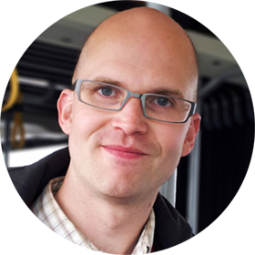

# My portfolio

## Who am I?

My name is Mikael Folkesson, and I am a software developer with a bachelor degree from LTH, Sweden. I am currently studying Machine Learning and Artificial Intelligence at a higher vocational school called IT-Högskolan in Gothenburg.

### My degrees

| Name | Description |
|---|---|
| *Bachelor in Software Engineering* | Bachelor in Software Engineering from Lunds Tekniska Högskola, Campus Helsingborg, 2003. |
| *Bachelor of Philosophy* | Majored in Western Literature, minored in Theoretical Philosophy with a tad of Practical Philosophy (ethics), 2008. |

## The purpose of this portfolio repository

I will add stuff to this repo continuosly during my time at ITHS, to show what projects I have done both as part of the assignments and personal projects.